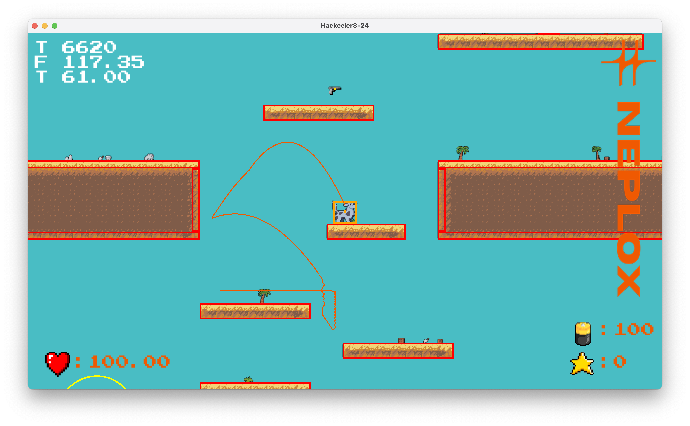
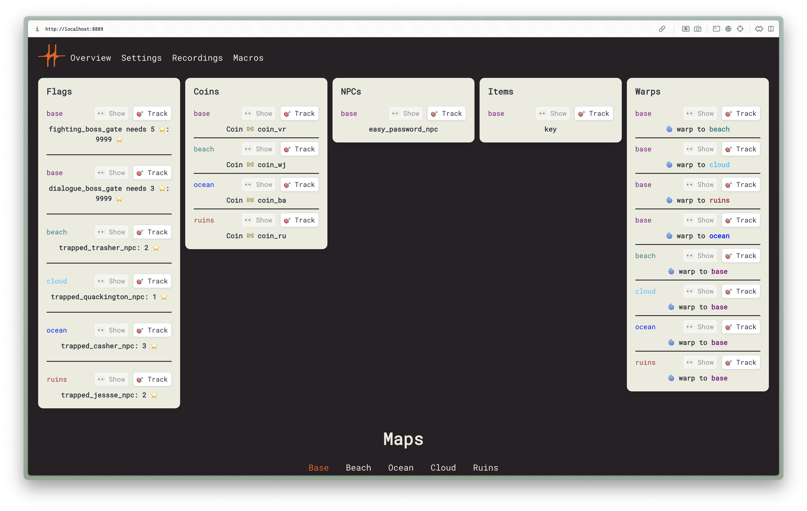
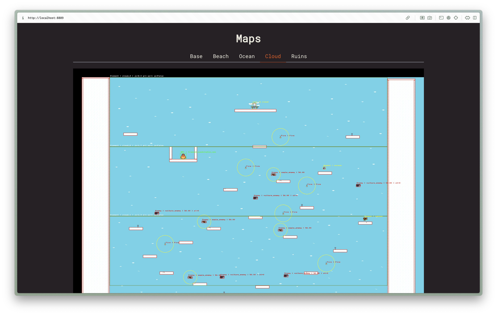
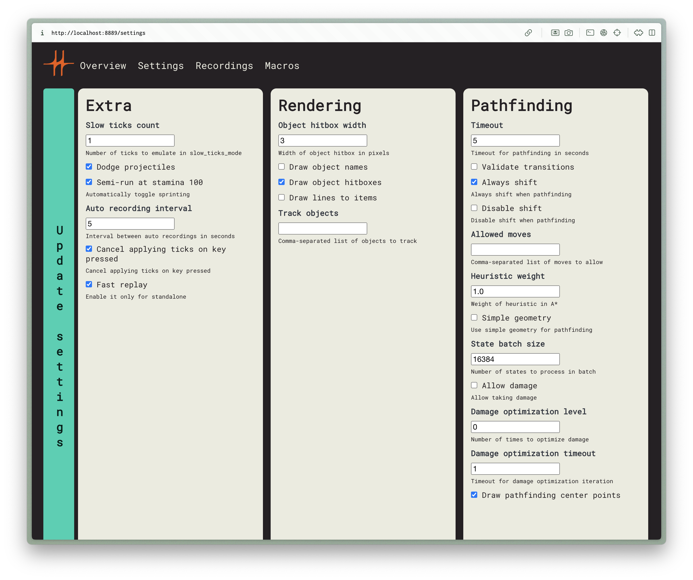
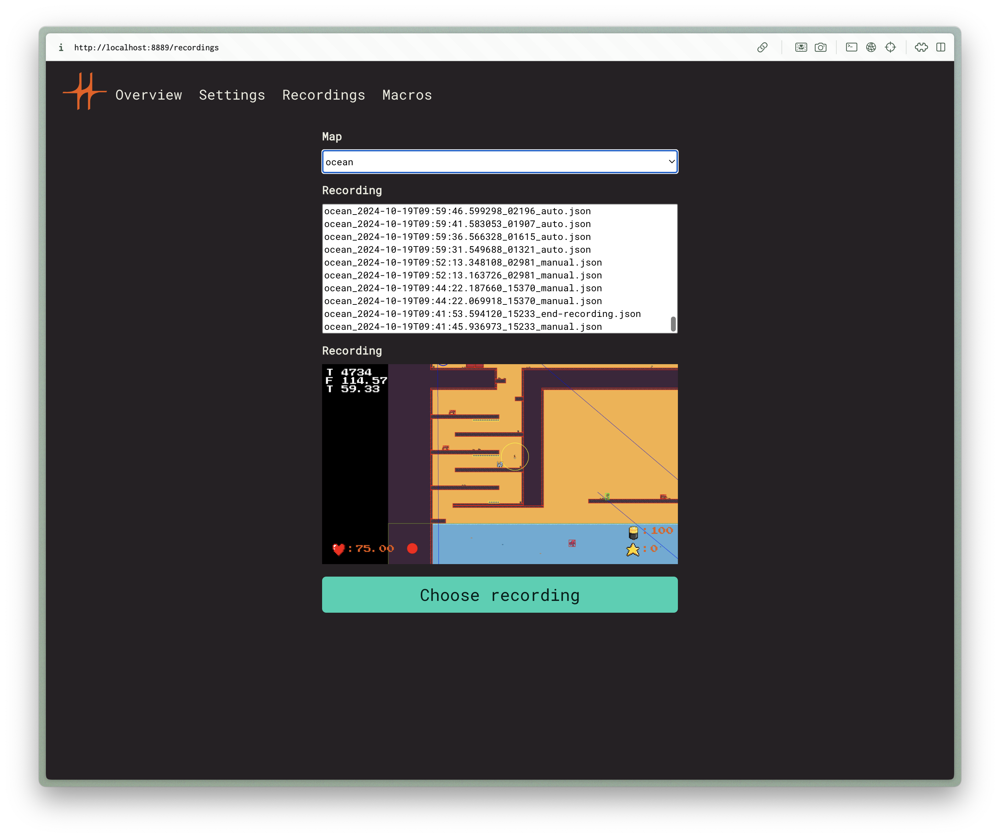
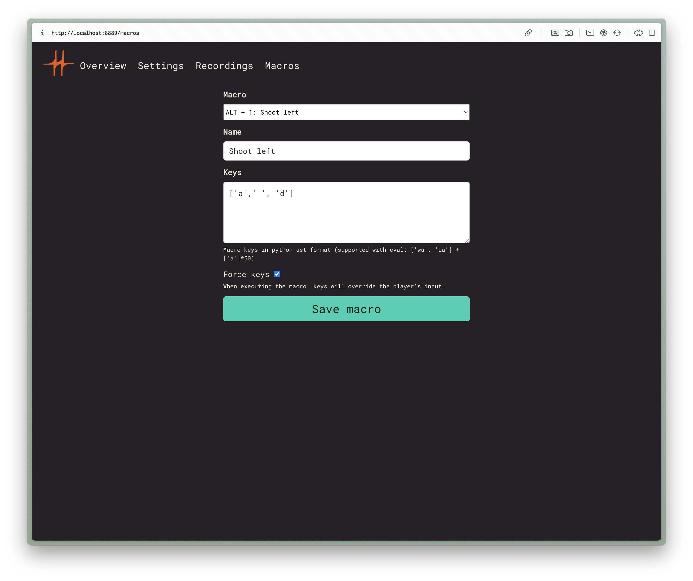

# Hackceler8 2024

Tooling for the Google CTF 2024 Hackceler8 finals by the C4T BuT S4D team.

## Features

- Pathfinding on left click using a parallel A\* ([cheats-rust/search](cheats-rust/search)), for which the whole physics engine was rewritten in Rust. Last year the search didn't allow taking damage, so it was impossible to use it to pass the obstacles with some damage. This year we've added a special mode to allow taking damage when pathfinding. It also minimizes the damage taken using binary search. We also beatifully draw the projected path of the player.
- We've rewritten the Python `round()` function in Rust to be blazing fast. Implementation can be found [here](cheats-rust/rround/src/lib.rs).
- GUI modifications to include hitbox highlighting, object (keys & other items) tracing, object names and auxilary info (fps, tps, ticks).
- Game zooming with `Ctrl+N` and `Ctrl+M`.
- Map overview mode enabled by `Ctrl+O` that allows moving the camera around the map with `WASD` (with optional speed modifier `Shift`).
- Numerous running optimizations, including endless semi-running with `Shift` pressed on every other tick.
- Tracking flags, coins, warps other items and NPCs selected in UI even through warps to other maps.
- Slow-tick mode toggled on `=`, with `Backspace` used to advance a constant (1 by default) number of ticks.
- Playthrough recording is toggled on `Ctrl+R`, with saves being taken every 5 seconds by default and additionally on various events (map change, death, manual save on `Ctrl+S`). Recording to be played can then be chosen in the cheats UI and played on `Ctrl+L`. **Fast replay** mode (controlled by UI setting) allows instantly replaying the recording when running in standalone mode.
- Up to 9 macros (useful for completing various NPC-related challenges) can be added through the cheats UI, and can be replayed manually using `Alt+N`.
- Prerender feature that renders all maps with debug info and shows it in Cheats UI. Generated with `./client.sh prerender`.
- Automatic shooting, enabled on `Ctrl+J`.
- Utility [client.sh](./client.sh) and [server.sh](./server.sh) scripts to start the game locally in different modes and with/without SSL.
- Automatic **projectile dodging**, simulating a few ticks into the future and saving the player from taking certain damage from enemy bullets and spikes.
- Pasting text into textboxes by [patching moderngl](./moderngl-paste.patch)
- The game is patched to work under macOS by [patching moderngl again](./moderngl-window-retina.patch)

### Game patches

For each game this repo has two branches: `game-X` is the unpatched version provided by orgs, and `game-X-patched` is the version with the cheats applied. Each branch has some specific changes applied, which are not ported to the master branch. Most notable is in `game-4-patched`, adding support for variable damage obstacles in pathfinding, allowing to find close-to-optimal solutions for `Fire` objects. This branch also modifies the algo to account for resetting `y_speed` on taking damage.

## Cheats UI

### Overview

Game overview with all information needed to complete the current game,
with the ability to track each object in the game. Maps prerendered using
`./client.sh prerender` are displayed here with text labels for all objects.

### Settings

Pathfinding parameters, GUI modifications, and other tooling parameters can be configured here.

### Recordings

Recordings are listed for each map with an additional screenshot of the game at the time when the recording was saved. The chosen recording is memorized on disk to allow fast replays when completing a level in standalone mode.

### Macros

Macros addition and selection, with support for Python `eval` for more
comfortable configuration of complex macros. Macros can additionally be
configured to force the macros keys to be pressed, useful for example
for shooting in the opposite direction on the fighting boss.

